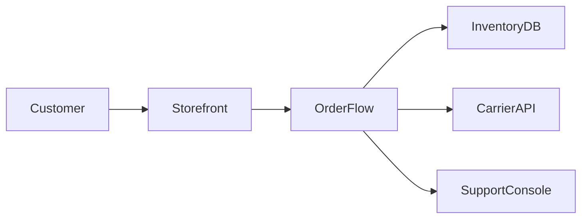

# System inventory

| Component | Responsibility | Owner | Runtime | Data | Upstream | Downstream | Deployment | Criticality |
|---|---|---|---|---|---|---|---|---|
| Web storefront | Collect customer order intents and submit checkout | Product team | Node.js | Session cache | Customer browser | OrderFlow monolith | Shared web deployment | High |
| OrderFlow monolith | Validate orders, reserve inventory, call carriers, update state | Fulfillment team | .NET Framework | SQL Server | Web storefront | Inventory DB, carrier APIs, support console | Single deployment unit | Critical |
| Inventory database | Store stock and reservation state | Platform data team | SQL Server | Inventory, reservations | OrderFlow monolith | Reporting jobs | Shared database server | Critical |
| Carrier adapter layer | Translate order shipment requests into carrier calls | Fulfillment team | .NET Framework library | Outbound request logs | OrderFlow monolith | Carrier APIs | Embedded in monolith | Critical |
| Support console | Inspect order state for support agents | Support tooling team | React | Read-only order projections | OrderFlow monolith | Support users | Separate frontend deploy | Medium |

## Context boundaries

## Hotspots
| Hotspot | Change frequency | Failure history | Test coverage | Recovery path |
|---|---:|---:|---:|---|
| Fulfillment routing inside monolith | High | High | 18% on critical paths | Manual flag rollback and database restore |
| Carrier timeout handling | Medium | High | 10% | Retry job plus support intervention |
| Inventory reservation transaction | Medium | Medium | 35% | SQL rollback if transaction not committed |
| Release rollback mechanics | Low | High severity | 5% | Full database restore and app redeploy |
