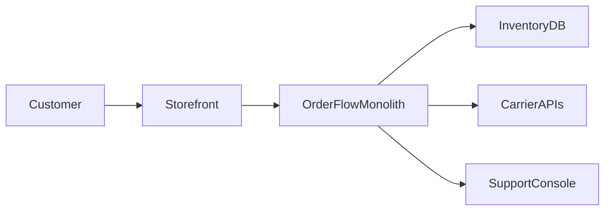

# Current-state architecture

## Summary

- System purpose: accept orders and coordinate inventory reservation plus shipment dispatch through a single fulfillment path.
- Main deployment units: storefront frontend, OrderFlow monolith, inventory database, support console.
- Main failure boundaries: carrier timeout handling, long-running SQL transaction scope, release rollback path.

## Context view

## Runtime concerns

| Concern | Current state | Signal | Risk link |
|---|---|---|---|
| Shipment dispatch | Synchronous carrier call is inside transaction | Duplicate shipments and stalled requests | R1, R2 |
| Rollback path | Requires redeploy plus SQL restore | Rehearsal exceeds desired recovery window | R3 |
| Observability | No shared correlation ID across request, SQL, and carrier attempt | Incident triage is slow and confidence is low | R2 |

## Constraints carried forward

- Technical: keep existing order contract stable during extraction.
- Operational: preserve reversible routing and audit trail.
- Organizational: modernization must fit the current team, not a separate rewrite program.
