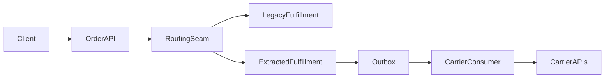

# Target-state architecture

## Outcome

- Decision this target state supports: incremental extraction of fulfillment without approving a full rewrite.
- Main architectural shift: move carrier-facing fulfillment logic behind a routed seam with outbox-backed dispatch.
- What remains intentionally unchanged: storefront, core order contract, and support console entry points.

## Target view

## Transition principles

- Reversibility: route traffic back to legacy fulfillment without data loss during RM-03.
- Observability: every state transition carries correlation and idempotency context.
- Blast-radius control: migrate by cohort and compare outcomes before broad cutover.

## Dependencies and assumptions

| Dependency | Why it matters | Validation trigger |
|---|---|---|
| Feature-flag routing seam | Enables reversible migration without dual code edits everywhere | Rehearse RM-03 rollback |
| Transactional outbox | Decouples carrier dispatch from request transaction | Validate duplicate-rate reduction after RM-02 |
| Correlation ID propagation | Needed for decision confidence and support operations | Confirm end-to-end traces before extraction |
