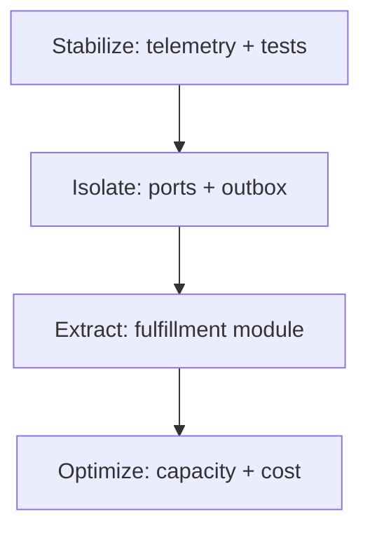

# OrderFlow assessment - fictional example

## Package index

- [Example package README](README.md)
- [Assessment intake](01-intake.md)
- [System inventory](02-system-inventory.md)
- [Risk register](03-risk-register.md)
- [Quality-attribute scenarios](04-quality-attribute-scenarios.md)
- [Modernization roadmap](06-modernization-roadmap.md)
- [Decision log](07-decision-log.md)
- [Technical debt map](08-technical-debt-map.md)
- [ADR-001](adr/ADR-001-incremental-modernization.md)

## Executive finding

OrderFlow can be modernized incrementally. The main constraint is not framework age but unobservable synchronous coupling between order submission, inventory, and shipping. A rewrite would move risk without first making behavior measurable.

## Evidence

- One deployment unit owns UI, order rules, inventory SQL, and carrier calls.
- Carrier timeouts hold database transactions open.
- No correlation identifier connects request, SQL changes, and carrier attempts.
- Release rollback requires a database restore.
- Characterization coverage exists for only 18% of critical order paths.

## Risks

| ID | Risk | I | L | D | Exposure | Recommendation |
|---|---|---:|---:|---:|---:|---|
| R1 | Duplicate shipment after retry | 5 | 4 | 5 | 100 | Idempotency + outbox before extraction |
| R2 | Unknown order state during carrier outage | 5 | 4 | 4 | 80 | Explicit pending state and correlation |
| R3 | Regression during module extraction | 4 | 4 | 4 | 64 | Characterization and contract tests |

Detailed risk scoring and ownership live in [03-risk-register.md](03-risk-register.md).

## Quality scenarios

1. A duplicate carrier callback produces one shipment transition and a traceable ignored event.
2. During a carrier outage, order intake completes within two seconds into `PendingFulfillment`.
3. Routing can return from the extracted module to legacy in under five minutes without data loss.

Detailed scenarios and measures live in [04-quality-attribute-scenarios.md](04-quality-attribute-scenarios.md).

## Recommendation

### 0-30 days - Stabilize
- Add correlation IDs and structured state-transition logs.
- Characterize the ten highest-value order paths.
- Measure carrier latency, duplicates, and transaction duration.

### 31-60 days - Isolate
- Place carrier calls behind a port.
- Add transactional outbox and idempotent consumer.
- Introduce feature-flagged routing.

### 61-90 days - Extract
- Extract fulfillment behind the existing contract.
- Shadow traffic, compare outcomes, then migrate cohorts.
- Retain reversible routing until SLOs hold for two release cycles.

The sequenced version of this plan lives in [06-modernization-roadmap.md](06-modernization-roadmap.md).

## Decision

Proceed incrementally under [ADR-001](adr/ADR-001-incremental-modernization.md). The accepted decision is recorded in [07-decision-log.md](07-decision-log.md), and linked debt items live in [08-technical-debt-map.md](08-technical-debt-map.md). Do not approve a full rewrite from current evidence.
