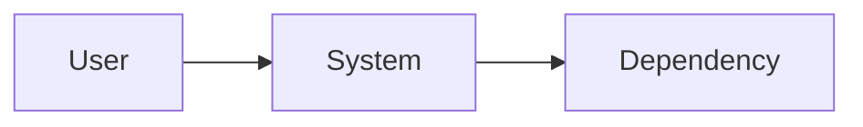

# Current-state architecture

## Summary

- System purpose:
- Main deployment units:
- Main failure boundaries:

## Context view

## Runtime concerns

| Concern | Current state | Signal | Risk link |
|---|---|---|---|

## Constraints carried forward

- Technical:
- Operational:
- Organizational:
