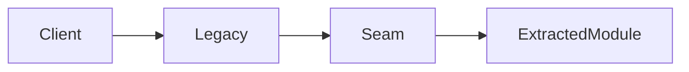

# Target-state architecture

## Outcome

- Decision this target state supports:
- Main architectural shift:
- What remains intentionally unchanged:

## Target view

## Transition principles

- Reversibility:
- Observability:
- Blast-radius control:

## Dependencies and assumptions

| Dependency | Why it matters | Validation trigger |
|---|---|---|
